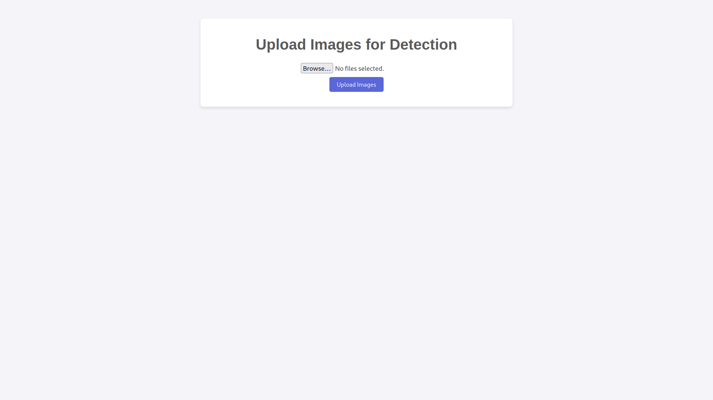
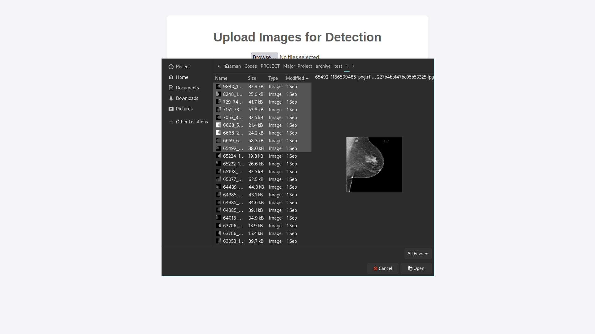
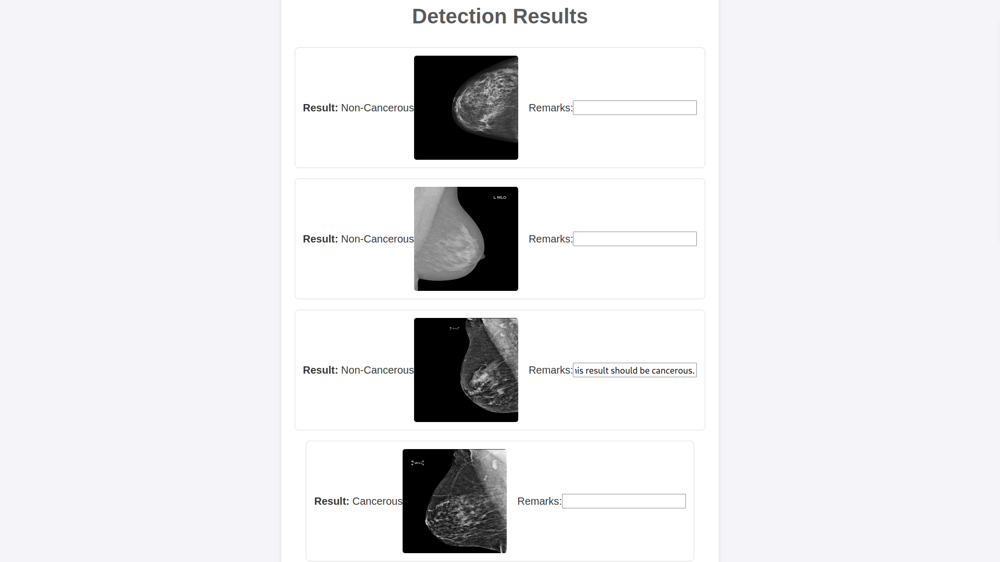

# Major_Project Improved
College Major Project on Breast Cancer Detection using EfficientNetB0

This project aims to classify mammography images into cancerous or non-cancerous using an improved model based on **EfficientNetB0** architecture, offering better performance and accuracy than previous models such as ResNet101.

Dataset:
https://www.kaggle.com/datasets/hayder17/breast-cancer-detection/data

This dataset contains 3,383 mammogram images focused on breast tumors, annotated in a folder structure. 
The dataset is split into seperate training, validation and testing folders containing 2372, 675 and 336 images respectively.

Note:
The training data is imbalanced containing 1569 healthy cases and 803 cancer cases.

## Installation and Usage

* Clone the repository.  
`git clone https://github.com/subarna-sutradhar/Breast-Cancer-Prediction-Using-EfficientNetB0.git`

* Install requirements using  
`pip install pip install -r requirements.txt`

* Build the model using the ModelBuild.ipynb file or the ModelBuild.py file.  
`python ModelBuild.py`

* To run the UI:  
`python app.py`

* User Interface.
  
  * The landing page is a simple image browse and upload button to enable the user to input the images for prediction.
    

  * The interface supports uploading multiple images or entire directories.

  * The prediction results are displayed along with the image.
  * A remark column is also provided to obtain information if the prediction is deemed incorrect by the user.
  * The remarks are saved along with the image name in the remarks.txt file.

## Key Features:
* The model is trained using Transfer learning on **EfficientNetB0**.
* Tensorflow and Keras is used.
* **Oversampling** is used in the training data to negate the effects of data imbalance.
* Improved accuracy and performance over the ResNet101-based approach.

### Note:
The data analysis and model building process is present in ModelBuild.ipynb file.

